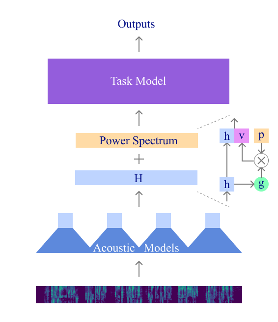
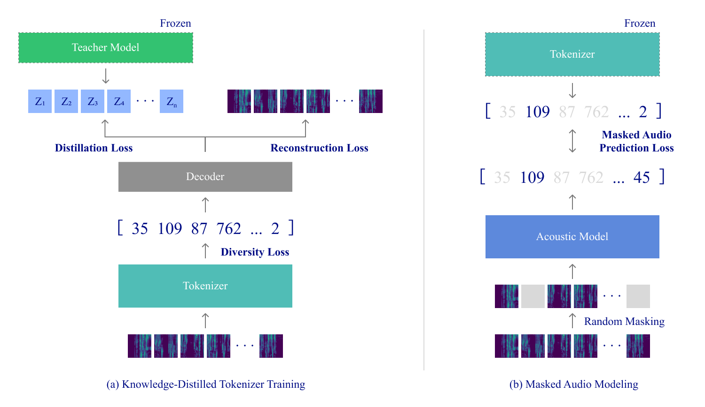

<div align="center">

# 🔊 HEAR

### A Human-Inspired Decoupled Architecture for Efficient Audio Representation Learning

**Harunori Kawano · Takeshi Sasaki**

[](#)
[](#)

</div>

---

## 💡 Overview

Standard SSL-based audio models (wav2vec 2.0, HuBERT, BEATs, etc.) rely on large monolithic Transformers that scale quadratically with sequence length, making them difficult to deploy on edge devices.

**HEAR** decouples the architecture into two specialized modules, inspired by the human auditory system:

| Module | Role |
|--------|------|
| 🎧 **Acoustic Model** | Extracts local acoustic features from fixed-length segments |
| 🧠 **Task Model** | Integrates local features globally for downstream classification |

This design achieves **15M parameters** and **9.47 GFLOPs** while maintaining competitive accuracy.

<div align="center">

</div>

---

## ⚙️ Setup

### 1 · Install dependencies

```bash
pip install -r requirements.txt
```

### 2 · Clone SSAST

SSAST is used as a frozen teacher model during tokenizer training.

```bash
git clone https://github.com/YuanGongND/ssast.git
```

### 3 · Edit SSAST source

Open `ssast/src/models/ast_models.py` and **remove** the two hardcoded path lines near the top:

```python
# ❌ Delete these two lines
sys.path.append("/data/sls/scratch/yuangong/aed-trans/src/models/")
sys.path.append("/data/sls/scratch/yuangong/aed-trans/src/")
```

Then **add** the following method to the `ASTModel` class and register it in the `forward` method.
This is called by `src/ssast.py` to extract hidden states for knowledge distillation:

```python
# In forward():
elif task == 'extract_hidden_states':
    return self.extract_hidden_states(x)

# New method:
def extract_hidden_states(self, x):
    B = x.shape[0]
    x = self.v.patch_embed(x)
    if self.cls_token_num == 2:
        cls_tokens = self.v.cls_token.expand(B, -1, -1)
        dist_token = self.v.dist_token.expand(B, -1, -1)
        x = torch.cat((cls_tokens, dist_token, x), dim=1)
    else:
        cls_tokens = self.v.cls_token.expand(B, -1, -1)
        x = torch.cat((cls_tokens, x), dim=1)
    x = x + self.v.pos_embed
    x = self.v.pos_drop(x)
    for blk in self.v.blocks:
        x = blk(x)
    x = self.v.norm(x)
    x = x[:, 2:]  # remove CLS and distillation tokens
    return x
```

### 4 · Download SSAST pretrained weights

Download **SSAST-Base-Patch-400** from the [SSAST repository](https://github.com/YuanGongND/ssast) and place it under `ssast/pretrained_model/`.
The path is passed to `SSAST(model_weight_path=...)` in `src/ssast.py`.

---

## 🏋️ Training

Training proceeds in three stages. Example step functions are in `src/train_step_example.py`.

<div align="center">

</div>

### Stage 1: Acoustic Tokenizer Training

Trains the `Tokenizer` to discretize mel-spectrogram frames into tokens.
Uses a frozen SSAST teacher alongside reconstruction and diversity losses.

```python
from src.frameworks.tokenizer_train_framework import TokenizerTrainFramework
from src.ssast import SSAST

teacher  = SSAST(model_weight_path="ssast/pretrained_model/SSAST-Base-Patch-400.pth")
framework = TokenizerTrainFramework(tokenizer_config, decoder_config, params)

reconstruction_loss, distillation_loss, diversity_loss = framework(
    inputs, input_lengths, knowledge_targets, training=True
)
```

### Stage 2: Masked Audio Modeling (MAM)

Pre-trains the `AcousticModel` with the frozen tokenizer as label generator.
40% of frames are masked; the model predicts the original discrete tokens at masked positions.

```python
from src.frameworks.pretrain_framework import PretrainFramework

framework = PretrainFramework(acoustic_model_config, tokenizer_config)
# load Stage 1 tokenizer weights into framework.tokenizer

loss = framework(inputs, input_lengths)
```

### Stage 3: Downstream Fine-tuning

Combines the pre-trained `AcousticModel` with `SpectrogramMixture`, `TaskModel`, and a classification head.

```python
from src.hear import HEAR

model = HEAR(acoustic_model_config, task_model_config, decoder_config)
# load Stage 2 acoustic model weights into model.acoustic_model

logits = model(inputs, input_lengths)
loss = torch.nn.functional.cross_entropy(logits, labels)
```

---

## 📊 Results

| Model | ESC-50 | GSCv1 | GSCv2 | VoxCeleb | Params | GFLOPs | RTF |
|:------|:------:|:-----:|:-----:|:--------:|-------:|-------:|----:|
| wav2vec 2.0 | — | 96.2 | — | 75.1 | 94M | 69.6 | 0.510 |
| AudioMAE | 94.1 | 96.9 | 98.3 | 94.8 | 85M | 42.4 | 0.244 |
| BEATs | 95.6 | 97.7 | 98.3 | — | 85M | 42.4 | 0.244 |
| **HEAR (Ours)** | **84.9** | **94.3** | **95.1** | **87.9** | **15M** | **9.47** | **0.095** |

> RTF measured on an ARM-based processor (Google Cloud, 4GB RAM, single thread, 10-second input).

---

## 🗂️ Repository Structure

```
src/
├── hear.py                           # Top-level HEAR model (Stage 3)
├── config.py                         # Configuration dataclasses
├── preprocessing.py                  # Waveform → log-mel spectrogram
├── params.py                         # Training hyperparameters
├── utils.py                          # Shared utilities
├── ssast.py                          # SSAST teacher model wrapper
├── train_step_example.py             # Example training step functions
├── models/
│   ├── acoustic_model.py             # Acoustic Model with sliding-window encoding
│   ├── encoder.py                    # Base encoder
│   ├── feature_extractor.py          # Convolutional front-end (stride-2 downsampling)
│   ├── contextual_encoder.py         # Transformer stack
│   ├── transformer.py                # Transformer layer with relative position attention
│   ├── positional_encoder.py         # Relative position embeddings
│   ├── spectrogram_mixture.py        # Gated power spectrum fusion
│   ├── tokenizer.py                  # Acoustic Tokenizer
│   ├── decoder.py                    # Spectrogram reconstruction decoder
│   ├── task_model.py                 # Task Model
│   └── classification_decoder.py     # Pooling-based classification head
└── frameworks/
    ├── tokenizer_train_framework.py  # Stage 1: Tokenizer training
    └── pretrain_framework.py         # Stage 2: Masked Audio Modeling
```

---

## 📄 Citation

```bibtex
% To be added after publication
```
